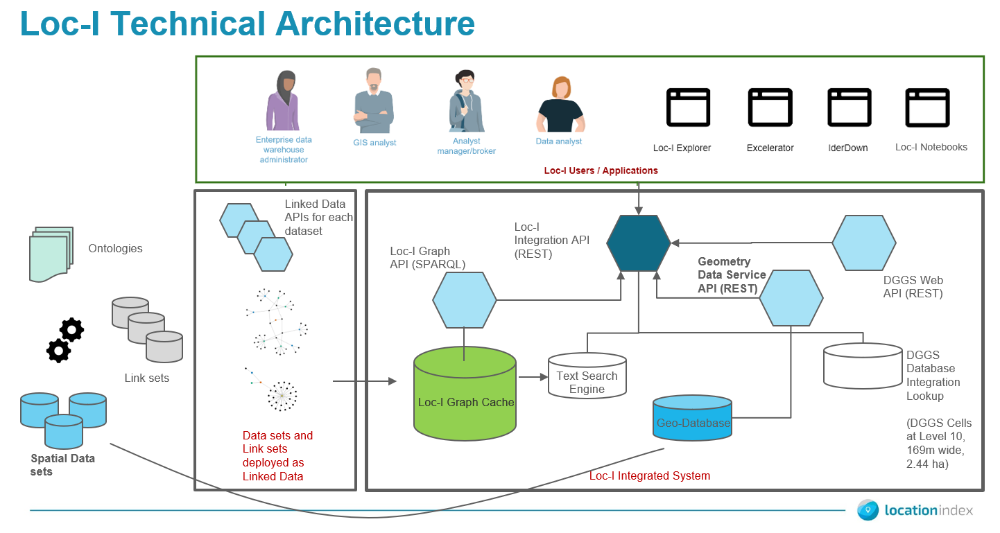
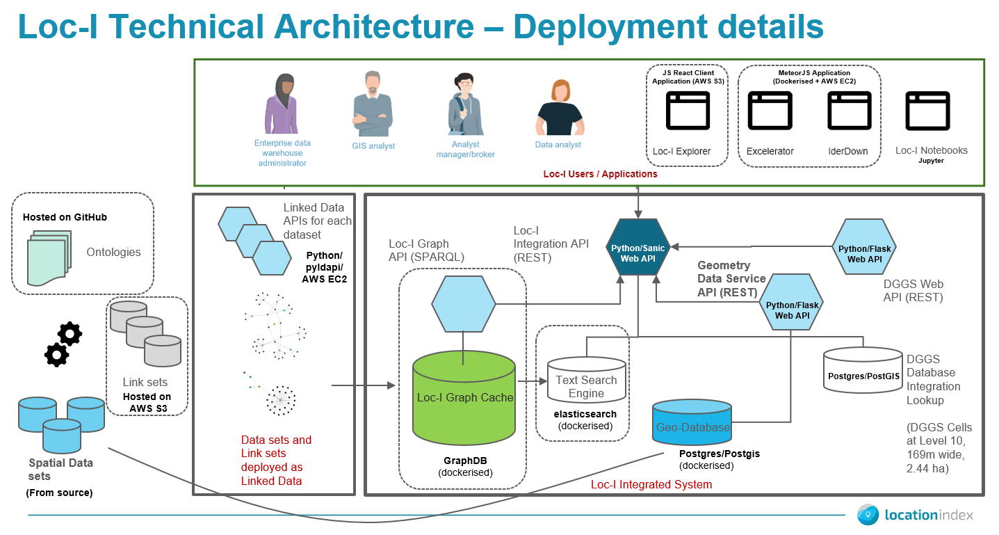

## System Overview for Deployment

## Implementation level deployment details 

## List of technologies used and deployment details

### Backend 

 
| Component            | Repo  |   Docker Images? | Technology Stack | Deployment detail |
|---------------------| -------| -------- |  -------| -------- |
| loci-integration-api |  [https://github.com/CSIRO-enviro-informatics/loci-integration-api](https://github.com/CSIRO-enviro-informatics/loci-integration-api)  | Main API based on `sanicframework/sanic:LTS`. [Dockerfile](https://github.com/CSIRO-enviro-informatics/loci-integration-api/blob/master/Dockerfile) ;    Elasticsearch image: `docker.elastic.co/elasticsearch/elasticsearch:6.3.1` | Python / Sanic / uvicorn | AWS ec2 instance |
|loci-cache | [https://github.com/CSIRO-enviro-informatics/loci-cache-scripts/](https://github.com/CSIRO-enviro-informatics/loci-cache-scripts/) |  Cache build docker image (based on `ubuntu:18.04`). See [Dockerfile](https://github.com/CSIRO-enviro-informatics/loci-cache-scripts/blob/jyucsiro/feature/gnaf_gf_harvest/docker/cache/Dockerfile) | GraphDB | AWS ec2 instance |
| loci-geometry-data-service |  [https://github.com/CSIRO-enviro-informatics/loci-geometry-data-service](https://github.com/CSIRO-enviro-informatics/loci-geometry-data-service)|  Image name: `csiroenvinf/geometry-data-service`.  See https://hub.docker.com/r/csiroenvinf/geometry-data-service   Image name: `kartoza/postgis:12.0` |  Python-Flask Web API, Postgres/PostGIS 12 | AWS ec2 instance |

### Application

| Component            | Repo  |  Docker Images? | Technology Stack | Deployment detail |
|---------------------| -------| -------- |  -------| -------- |
| loci-explorer |  [https://github.com/CSIRO-enviro-informatics/loci-integration-app](https://github.com/CSIRO-enviro-informatics/loci-integration-app) |  Based on `node:10`. See [Dockerfile](https://github.com/CSIRO-enviro-informatics/loci-integration-app/blob/master/Dockerfile) | ReactJS client application | Deployed and hosted via AWS S3 |
| loci-excelerator (Excelerator / IderDown) |  [https://github.com/CSIRO-enviro-informatics/loci-excelerator/](https://github.com/CSIRO-enviro-informatics/loci-excelerator/) |  No docker deployment yet | MeteorJS client application | Deployed and hosted via AWS ec2 |
| loci-notebooks (Jupyter notebooks for Loc-I) |  [https://github.com/CSIRO-enviro-informatics/loci-notebooks](https://github.com/CSIRO-enviro-informatics/loci-notebooks) |  Image:  Based on `jupyter/minimal-notebook`. See [Dockerfile](https://github.com/CSIRO-enviro-informatics/loci-notebooks/blob/master/Dockerfile) | JupyterHub | Deployed locally or on cloud providers if needed |

