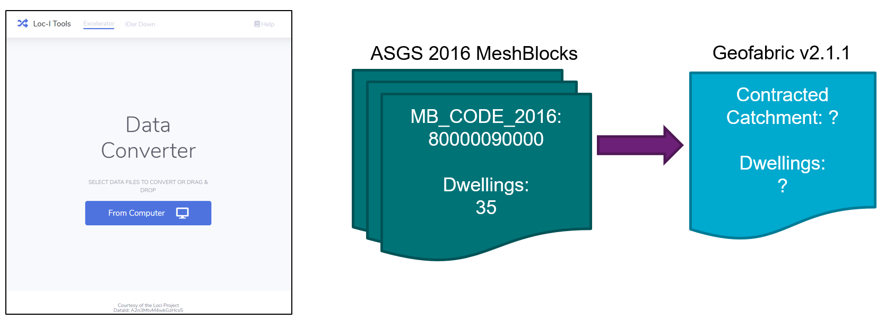

# Excelerator  

[http://excelerator.loci.cat](http://excelerator.loci.cat)

## What 

A data reapportionment tool. This tool will enable users to reapportion data values referenced using one Loc-I data set to another Loc-I dataset, e.g. population count by ASGS Meshblocks reapportioned to Geofabric contracted catchments. 

The figure below shows a screenshot of the User interface and a depiction of the kind of thing that 
Excelerator does - takes a CSV data file with a column of location identifiers (local or Loc-I identifiers), 
some observation data (number of dwellings), and converts the data into a representation in another geography 
(e.g. Geofabric Contracted Catchments). 

## Why 

Reapportioning data is a frequently performed, time-consuming and error prone function. Pre-calculating the correspondences between Loc-I datasets and publishing these in machine-readable ways enable users to access and use reliable recipes for spatial reapportionment of data. 

How: Users are provided an online portal to upload or (reference a web accessible) tabular data file that contains a georeferenced column and a data column with rows containing spatial feature identifiers and corresponding data values. Using the source user input to the tool, the tool will utilise the Loc-I dataset to determine what reapportionments are possible. This is done using pre-calculated linksets that describe the spatial intersection between Loc-I datasets. The user will select a target reapportionment loci dataset and hit go. The system will calculate the reapportionment and provide an output spreadsheet containing the reapportioned data and Loc-I identifiers for each spatial feature in the target Loc-I dataset.

MVP –  An online user interface providing basic ability to reapportion data uploaded in a spreadsheet georeferenced using a source Loc-I dataset to a target Loc-I dataset output as a tabular file for download. The MVP is limited to conversions between dataset base types which are “Meshblock” for the ASGS datasets, “Contracted Catchment” for the Geofabric dataset.

## Examples 

Examples to use as input files to Excelerator can be found in [the examples directory](/examples/analysis-data) of loci.cat. Simply drop them into the Excelerator portal, select the source reporting geography and feature set and hit go.

## Feature notes

* Aautodetect uploaded geographies (if using Loc-I identifiers)
* Reapportion between products at different spatial levels e.g. Contracted catchments to SA1s, SA2s to G-NAF addresses

## Future features

* Ability to incorporate more sophisticated reapportionment processes including interaction with the “Your Data Your Regions (YDYR)” tool 
* Ability to reapportion data in web accessible files
* More sophisticated tools to assist users in reapportionment – map view of their data 
