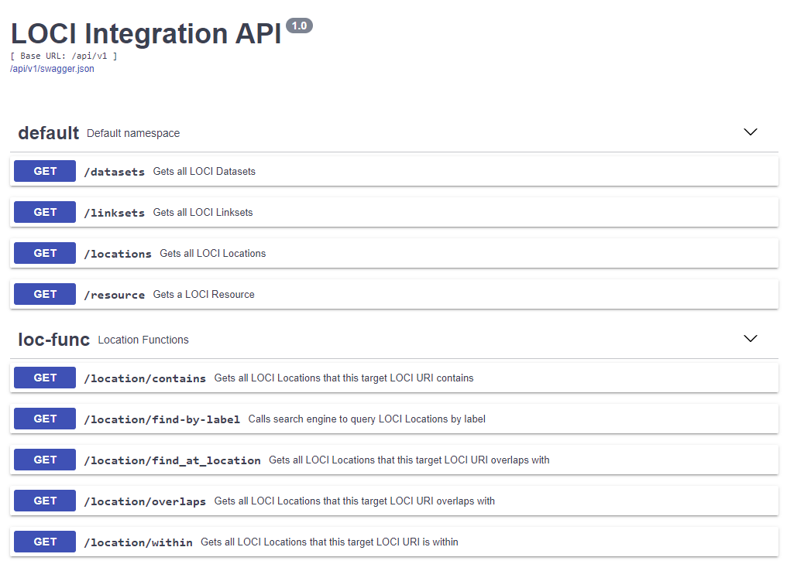

# Loc-I Integrated API

[Link to API here](https://api2.loci.cat).

## What

A REST API to a Loc-I Integrated Cache.
     
## Why

Provides developers and technical analysts with interfaces to the [Loc-I reference cache](ref-cache.md) to build applications and query a Loc-I cache without having to know SPARQL. This allows rapid development of applications using the REST API.

## How 

Via the REST API. Swagger doc available [here](https://api2.loci.cat/api/v1/doc).

     
## MVP 

## Anticipated future functionality

* Added API endpoints to handle "L-shaped" and "U-shaped" crosswalks between geographies