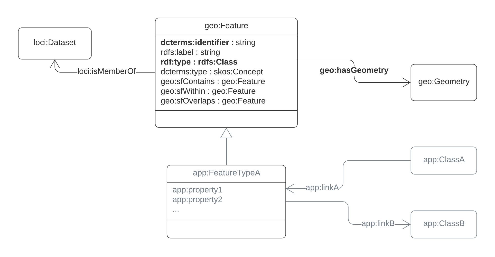

# Rules for Loc-I datasets
This page describes rules for datasets, conformance to which enables datasets to be integrated in the Loc-I index.

## Loc-I principles
Loc-I focuses on providing persistent identifiers for spatial objects, and linking between locations from different datasets. 

Loc-I is concerned with descriptions of geospatial entities or locations, known as **features**, which are described within datasets that are maintained by distinct authorities and processes. 
The goal is to allow the spatial relationships with features from other datasets to be easily accessible - particularly spatial containment and overlap. 
While these relationships might _in theory_ be computed on-the-fly, for various reasons this is not always practical or desirable. 
The Loc-I index computes and assembles the relationships in advance, through various procedures which are tuned to the different sources. 
Some relationships between objects are inherent in the original datasets, some are computed from their spatial geometry and extent, and some arise from other considerations, such as jurisdictional arrangements. 
The relationships then enable various Loc-I services, such as [Excelerator](excelerator.md) and [IderDown](iderDown.md)

Each significant relationship between features is realised as an explicit 'link'. 
Metadata is associated with each link in order to indicate where it comes from. 
The set of links is managed and stored separately from either the source or target data. 

To support Loc-I, access to a linked-data view of each Loc-I dataset through an RDF representation of the data is required. 

## Core properties
### Required (mandatory)
Properties required for a spatial dataset to be compatible with Loc-I:

- a **persistent identifier** (i.e. an externally-referenceable [surrogate-key](https://en.wikipedia.org/wiki/Surrogate_key)). This allows persistent links between features.  
- the feature **classification** - i.e. the type of the feature from the context in which it was defined, e.g. MeshBlock, Address, Catchment 
- a **georeferenced geometry** associated with the feature - usually expressed as a point, line, line, polygon, a set of pixels, a set of DGGS cells, etc. This allows spatial relationships to features in new datasets to be determined

### Recommended (optional)
Useful but optional properties:
- a **name** for the feature - to support discovery through natural interfaces
- the size (**length** or **area**) of the feature- to support re-apportionment functions
  - will be computed from the geometry if not provided a-priori (not required for features whose geometry is a Point). 
- pre-defined **spatial or logical relations** with other features in the same dataset (internal links) 
  - in-built relationships usually provide the most reliable basis for spatial links, and are commonly part of hierarchically organized datasets. For example, in the [Australian Statistical Geography Standard](https://www.abs.gov.au/websitedbs/D3310114.nsf/home/Australian+Statistical+Geography+Standard+(ASGS)) all spatial objects are built up from aggregates of _meshblocks_, or the [Australian Hydrological Geospatial Fabric (GeoFabric)](http://www.bom.gov.au/water/geofabric/) within which all reporting-regions are composed of _catchments_. 

All other properties are application specific, thus not normally of direct interest in the context of Loc-I. 

## Implementation as linked data
The Loc-I core feature model uses elements from the following standard RDF vocabularies

| prefix | namespace | description |
| --- | --- | --- |
| `dcterms:` | http://purl.org/dc/terms/ | Dublin Core terms |
| `rdf:` | http://www.w3.org/1999/02/22-rdf-syntax-ns# | RDF | 
| `rdfs:` | http://www.w3.org/2000/01/rdf-schema# | RDF Schema |
| `geo:` | http://www.opengis.net/ont/geosparql# | OGC GeoSPARQL |
| `geox:` | http://linked.data.gov.au/def/geox# | GeoSPARQL Extensions |
| `loci:` | http://linked.data.gov.au/def/loci# | Loc-I ontology |
| `data:` | http://linked.data.gov.au/def/datatype/ | AGLDWG Datatypes |

The Loc-I core feature model implements the mandatory and option properties as follows: 
1. each geospatial feature is encoded as a `geo:Feature` 
2. the persistent identifier appears as 
  - the value of `dcterms:identifier` 
  - the **persistent URI** that identifies the feature - this must follow the [Loc-I URI convention](URI-conventions.md)
3. the name of each feature is provided as the value of `rdfs:label` 
4. the feature-type or classification is encoded as 
  - `rdf:type` if the classifier is an `rdfs:Class` or `owl:Class`, which must be a sub-class of `geo:Feature`
  - `dcterms:type` if the classifier is something else, such as a `skos:Concept` 
5. the geometry is provided as the value of `geo:hasGeometry` 
6. the area is recorded as the value of `geox:hasArea` or `geox:hasAreaM2`
7. spatial relations are recorded using `geo:sfWithin`, `geo:sfContains`, `geo:sfOverlaps`
8. other part-whole relations may be recorded using `loci:isPartOf`, `loci:hasPart` or sub-properties of these defined in applications
9. membership of a registered dataset is recorded using `loci:isMemberOf`



_Core model for Loc-I features. Required elements in **bold**. Application-specific classes and properties in grey_

RDF datasets may be serialized in many ways. The [Terse RDF Triple Language (Turtle)](https://www.w3.org/TR/turtle/) is a lightweight format that is easily editable and quite readable. [JSON-LD](https://www.w3.org/TR/json-ld11/) is a JSON-based format that might be more usable in many web contexts. 

## Validation

An RDF dataset may be tested for conformance to the Loc-I requirements in many ways. 
The [Shapes Constraint Language (SHACL)](https://www.w3.org/TR/shacl/) provides a standard, executable method. [SHACL playground](https://shacl.org/playground/) is a convenient tool for basic testing. [pySHACL](https://github.com/RDFLib/pySHACL) is a 

The constraints on `geo:Feature` required for Loc-I compatibility are defined in a `NodeShape` for `loci:Feature` in the [Shapes graph designed for for Loc-I](https://github.com/CSIRO-enviro-informatics/loci-ont/blob/shacl-feature-issue8/loci.shapes.ttl). This can be used to test data for basic conformance to Loc-I requirements. 

## Queries

The significant benefit of having a common core is that the queries underlying standard Loc-I services are common across datasets - i.e. the SPARQL queries have no dependence on RDF predicates from application-specific vocabularies, only from `rdf:`, `dcterms:`, `rdfs:`, `geo:`, `geox:` and `loci:`. 

(detailed examples TBC)

## Examples showing only core properties
```
<http://linked.data.gov.au/dataset/asgs2016/statisticalarealevel2/205031088>
  rdf:type geo:Feature , asgs:StatisticalAreaLevel2 ;
  dcterms:identifier "205031088"^^asgs-id:sa2Maincode2016 ;
  rdfs:label "French Island"^^asgs-id:sa2Name2016 ;
  geo:hasGeometry <http://gds.loci.cat/geometry/asgs16_sa2/205031088> ;
  geox:hasAreaM2 [
      data:value 170229100.0 ;
    ] ;
  geo:sfContains <http://linked.data.gov.au/dataset/asgs2016/statisticalarealevel1/20503108801> ;
  geo:sfWithin <http://linked.data.gov.au/dataset/asgs2016/stateorterritory/2> ;
  geo:sfWithin <http://linked.data.gov.au/dataset/asgs2016/statisticalarealevel3/20503> ;
  loci:isMemberOf <http://linked.data.gov.au/dataset/asgs2016/statisticalarealevel2/> ;
.

<http://linked.data.gov.au/dataset/asgs2016/meshblock/20663970000>
  rdf:type geo:Feature , asgs:MeshBlock ;
  dcterms:identifier "20663970000"^^asgs-id:mbCode2016 ;
  dcterms:type asgs-cat:primary-production ;
  geo:hasGeometry <http://gds.loci.cat/geometry/asgs16_mb/20663970000> ;
  geox:hasAreaM2 [
      data:value 58387600.000000007450580596923828125 ;
    ] ;
  geo:sfWithin <http://linked.data.gov.au/dataset/asgs2016/stateorterritory/2> ;
  geo:sfWithin <http://linked.data.gov.au/dataset/asgs2016/statisticalarealevel1/20503108801> ;
  loci:isMemberOf <http://linked.data.gov.au/dataset/asgs2016/meshblock/> ;
.

<http://linked.data.gov.au/dataset/gnaf-2016-05/address/GAVIC411436309>
  rdf:type geo:Feature , gnaf:Address ;
  dcterms:identifier "GAVIC411436309"^^gnaf:gnaf-2016-05 ;
  rdfs:label "Address GAVIC411436309 of Rural type" ;
  dcterms:type <http://gnafld.net/def/gnaf/code/AddressTypes#Rural> ;
  geo:hasGeometry [
      a sf:Point ;
      gnaf:gnafType <http://gnafld.net/def/gnaf/code/GeocodeTypes#PropertyAccessPointSetback> ;
      dcterms:type <http://gnafld.net/def/gnaf/code/GeocodeTypes#PropertyAccessPointSetback> ;
      geo:asWKT "<http://www.opengis.net/def/crs/EPSG/0/4283> POINT(145.35714361 -38.34785008)"^^geo:wktLiteral ;
      rdfs:label "Property Access Point Setback" ;
    ] ;
  loci:isMemberOf <http://linked.data.gov.au/dataset/gnaf-2016-05/address/> ;
.

<http://linked.data.gov.au/dataset/geofabric/drainagedivision/9400210>
  rdf:type geo:Feature , geof:DrainageDivision ;
  dcterms:identifier "9400210"^^geof:geofabric-id ;
  geo:hasGeometry <http://gds.loci.cat/geometry/geofabric2_1_1_awradrainagedivision/9400210> ;
  geox:hasAreaM2 [
      data:value 134617156547.115 ;
      <http://www.w3.org/ns/qb4st/crs> <http://www.opengis.net/def/crs/EPSG/0/3577> ;
    ] ;
  geox:hasAreaM2 [
      data:value 135039327241.81703 ;
      <http://www.w3.org/ns/qb4st/crs> <http://www.opengis.net/def/crs/EPSG/0/4938> ;
    ] ;
  loci:isMemberOf <http://linked.data.gov.au/dataset/geofabric/drainagedivision/> ;
.

```
## Links

As mentioned above, links between features are realised and stored explicitly. See this explanation of the [schema for link statements](link-statements.md).

## Application schemas

An [Application Schema](https://www.iso.org/standard/59193.html) is a data model designed to support the functional requirements of a particular application. 
This will involve more specific classes and properties related to the domain of discourse. 
Design of a application-schema is the responsibility of the data provider, in consultation with their user community. 

In order to ensure that an Application Schema complies with the conformance rules above, it is recommended to use Loc-I core as the basis, and add additional classes and properties as required to support the application. Some of the classes in an application schema will be Features, and these should be axiomatized as sub-classes of `geo:Feature`. Other classes and properties will extend the application schema outside the scope of Loc-I, and there are no specific constraints arising from Loc-I in these cases. 

See [Loc-I application schemas](loci-ontologies.md) for a basic outline of the ontologies for the initial Loc-I conformant datasets. 
