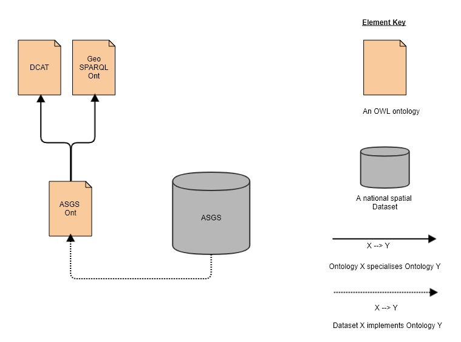
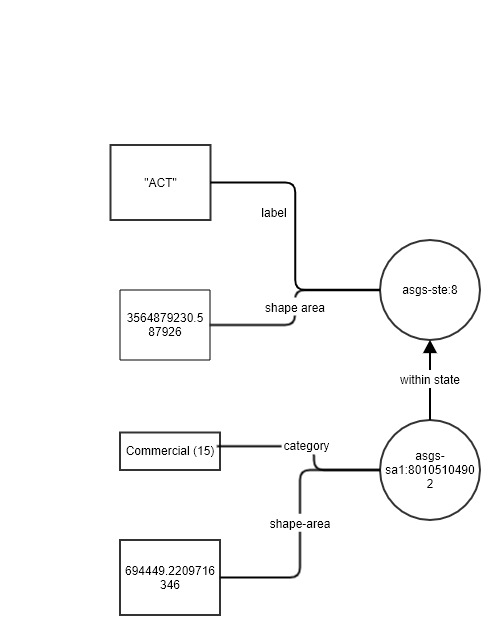

# Principles

Loc-I is tackling the challenge of stabilising the identity of geographies and their locations. 
By stabilising the identity of geographies and their locations, people and systems are able to reference locations more precisely and interoperate across geographies in a more seamless way. 
This is achieved using ontologies and Linked Data identifiers for items in the respective datasets.

## Linked Data and Loc-I Datasets

Loc-I relies on the Linked Data technology stack for technical interoperability with other Web-based data and overarching models (i.e. ontologies) for conceptual alignment, such as those published by the Australian Government Linked Data Working Group. 

## Ontologies 

An ontology is a document which captures the conceptual model of things in the world. The ontologies provide the foundational semantic definitions needed for consistently describing the respective geography dataset, their members and its relationships to other objects, e.g. ASGS 2016 and its features such as each Mesh Block, SA1, SA2, SA3, and SA4 region. The figure below show how the ASGS dataset is “spatially-enabled” into Loc-I by documenting the semantic concepts and relationships of the ASGS dataset. 

Figure 1. Example of the ASGS dataset that has been spatially-enabled into Loc-I using the ASGS ontology

In the current version of Loc-I, ontologies have been developed for each geography, i.e. ASGS, Geofabric, G-NAF.  More details on the Loc-I ontologies can be found here: http://locationindex.org/definitional.html

Loc-I ontologies are modelled using the Web Ontology Language (OWL). This means data according to the ontologies is represented in Resource Description (RDF) formats, can be stored in an RDF triplestore (a form of graph database), be queried using the SPARQL query language and can be joined to any other data that is also presented according to any of the very many OWL models in RDF.

OWL was chosen as the modelling system as there are numerous public OWL models in wide use of relevance to this project's domain (e.g. the Organization Ontology) and OWL models are specialisable, extensible, technically interoperable (with any other OWL models) and data made according to them can be presented online as Linked Data allowing human- and machine-access across institutions.

Refer to the [Models Page](models.md) for more details on the list of ontologies and background models.

## Linksets

Linksets introduces a consistent way to access, analyse and use location data to support reliable and repeatable processes through automation and application of standards. Streamline data access and analysis provides faster and more accurate way to support a range of policy questions. Linking data together is a good way to extract inforamtiion from different sources.

Loc-I Linksets are also modelled using the Web Ontology Language (OWL) and encoded in RDF. This provides direct integration with other RDF datasets and is aligned with the Loc-I ontologies.

## Linked Data Identifiers

Linked Data uses the Web to connect related data together via web identifiers. These web identifiers are the building blocks on which descriptions of data can attached. These then form a graph of data that is scalable online. Web identifiers are minted for each Loc-I location to enable linking that is unambiguous, i.e. instead of linking terms like “ACT”, we can now unambiguously use the web identifier ‘http://linked.data.gov.au/dataset/asgs2016/stateorterritory/8’ to reference the location, which resolves to a ASGS State or Territory Feature. This Feature is also a concept that has been explicitly captured and defined in the ASGS ontology as a concept. Looking up the web identifier provides additional information about the resource and related objects, which in turn could be resolved to get more information. 

We can also similarly apply these for other Feature types that is defined in the data and captured in the respective ontology, such as ASGS Statistical Area 1 Features. These in turn can then be used to resolve and annotate relevant information about the feature using Linked Data systems, for example, for the ASGS 2016 SA1 of 80105104902, we can mint the Linked Data web identifier of http://linked.data.gov.au/dataset/asgs2016/statisticalarealevel1/80105104902, and annotate information such as which regions in the ASGS 2016 that they are within or contain, what are the alternate labels used to identify this region, and other regions that this feature intersects with. 

The figure below shows an excerpt of the Linked Data graph view of the ASGS 2016 dataset where  http://linked.data.gov.au/dataset/asgs2016/stateorterritory/8 is linked with the SA1 region http://linked.data.gov.au/dataset/asgs2016/statisticalarealevel1/80105104902 by the ‘within state’ property and additional information about each data item has more details annotated as nodes in the graph, such as the label, the category the SA1 region belongs to and the area. 

Nodes such as these can then be easily connected to other Dataset nodes and scaled up across the world-wide-web (WWW) as a web of data. Users can then traverse these links using standard web protocols. The Loc-I infrastructure also caches these nodes in a central RDF triple store and provides APIs to query these resources via a Hybrid Spatial Knowledge Graph (see the next section for more details).

## Loc-I Datasets

As discussed above, in order to create a Loc-I dataset from a spatial dataset such as the ASGS, the semantics and identity of the resources of the spatial dataset is required. 

## Loc-I Linksets

Loc-I Linksets are a special kind of data asset. The aim of Loc-I Linksets is to provide a set of relationships between spatial datasets in a consistent way with clear provenance and governance. Linksets encode the relationships 

 a consistent way to access, analyse and use location data to support reliable and repeatable processes through automation and application of standards. Streamline data access and analysis provides faster and more accurate way to support a range of policy questions.
Linking data together is a good way to extract information from different sources.

