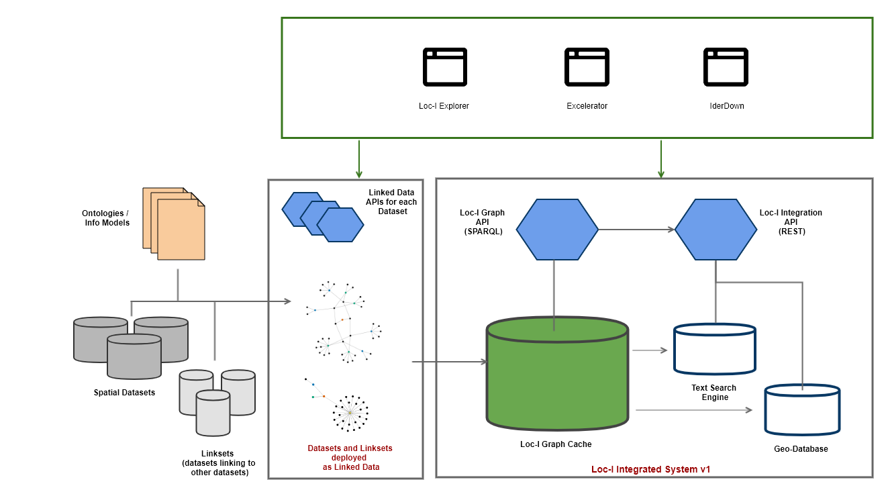
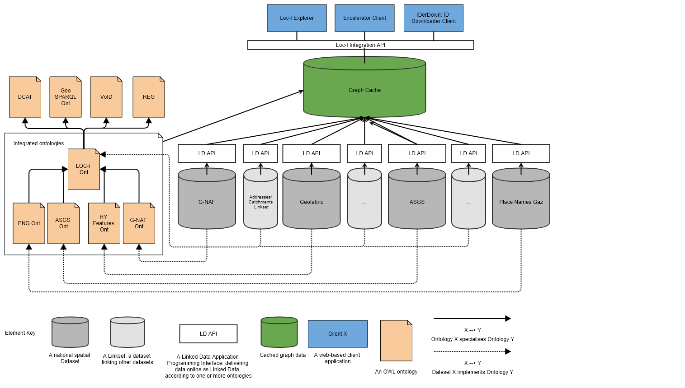

# Loc-I Reference Integrated Cache

## What

Central reference cache that loads a set of reference spatial layers directed by the Loc-I steering committee.
     
## Why

The Loc-I integrated graph cache provides a graph store for applications and users to query spatial linked data features. This provides users with SPARQL APIs that allows for flexible and powerful queries across the graph store (triple store).
     
## How 

Via a graph store (RDF triple store). The current implementation uses GraphDB.

## Simplified architecture view 

### Detailed architecture view 

## MVP 

GraphDB store that caches ASGS 2016, Geofabric v2.1.1, G-NAF (as of May 2016).

## Anticipated future functionality

* Added datasets (ASGS 2011, G-NAF 2019, QLD Cadastre)

