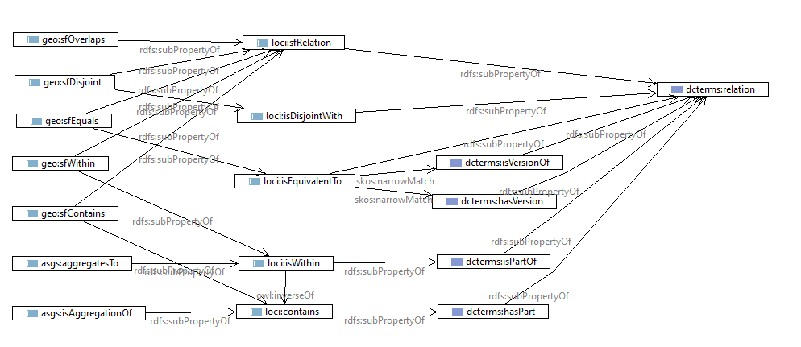

# Relations

A number of relationship predicates used to describe **relationships between spatial features** in Loc-I and in the context of individual Loc-I datasets, as follows: 

## GeoSPARQL

From [GeoSPARQL](https://www.ogc.org/standards/geosparql) the following geospatial-topological relationships are of interest

Relation | definition 
--- | ---
`sfContains` |  Exists if the subject SpatialObject spatially contains the object SpatialObject. DE-9IM: T\*\*\*\*\*FF\*
`sfWithin` | Exists if the subject SpatialObject is spatially within the object SpatialObject. DE-9IM: T\*F\*\*F\*\*\*
`sfOverlaps` | Exists if the subject SpatialObject spatially overlaps the object SpatialObject. DE-9IM: T\*T\*\*\*T\*\* 
`sfEquals` | Exists if the subject SpatialObject spatially equals the object SpatialObject. DE-9IM: TFFFTFFFT
`sfDisjoint` | Exists if the subject SpatialObject is spatially disjoint from the object SpatialObject. DE-9IM: FF\*FF\*\*\*\*

This is a subset of the **Simple Features** implementation of the DE-9IM relations. [GeoSPARQL](https://www.ogc.org/standards/geosparql) also provides **Egenhofer** and **RCC8** implementations. 

## ASGS

In [ASGS](http://linked.data.gov.au/def/asgs) the relationships that are specified between different ASGS structures are implemented by

Relation | definition 
--- | ---
`isAggregationOf` | The context resource is an aggregation of (composed of) one or more of the target resources 
`aggregatesTo` | The context resource aggregates to the target resource 

## Loc-I

In [Loc-I](http://linked.data.gov.au/def/loci) the following generalized topology relations are defined

Relation | definition 
--- | ---
`isEquivalentTo`\* | The target feature is intended to represent the same real-world entity as the context feature
`contains`\* | The context resource contains the target resource, in some geospatial, logical, ownership, governance, jurisidictional or compositional sense 
`isWithin`\* | (inverse of `contains`) The context resource is within or is part of the target resource, in some geospatial, logical, ownership, governance, jurisidictional or compositional sense
`isDisjointWith`\* |  The target resource does not touch or intersect with the context 
`sfRelation`\* | A geospatial-topological relationship (utility property - superset of all the `geo:sf*` properties)

\* indicates 'provisional'. 

## Dublin Core

Meanwhile [Dublin Core](https://dublincore.org/specifications/dublin-core/dcmi-terms/) provides the following general-purpose relations to describe either part-whole or versioning relationships between resources

Relation | definition 
--- | ---
`relation` | A related resource
`hasPart` | A related resource that is included either physically or logically in the described resource
`isPartOf` | A related resource in which the described resource is physically or logically included
`replaces` | A related resource that is supplanted, displaced, or superseded by the described resource
`isReplacedBy` | A related resource that supplants, displaces, or supersedes the described resource
`hasVersion` | A related resource that is a version, edition, or adaptation of the described resource
`isVersionOf` | A related resource of which the described resource is a version, edition, or adaptation

Note that this is only a small subset of the full set of sub-properties of the Dublin Core `relation` property. 

## All relations hierarchy

The Dublin Core and Loc-I relations can join the GeoSPARQL and ASGS relations into a single sub-property hierarchy: 

This will support more generalized queries across datasets and linksets in a Loc-I context. 

---
Some additional notes, incomplete ...

# Identity and revisions

## ASGS 
More than one dataset (revision cycle) in ASGS
- ABS structures - 5-yearly
- non-ABS structures - annually

Do we treat URIs as a single dataset, with URI's being members of time-stamped datasets
Or do we make the URI's time-stamped and then record feature equivalence relationships explicitly 

## GNAF
Ontology needs a big refresh. 
Has time properties at entity level
(StreetLocality incorrected modelled as sub-class of Street)

